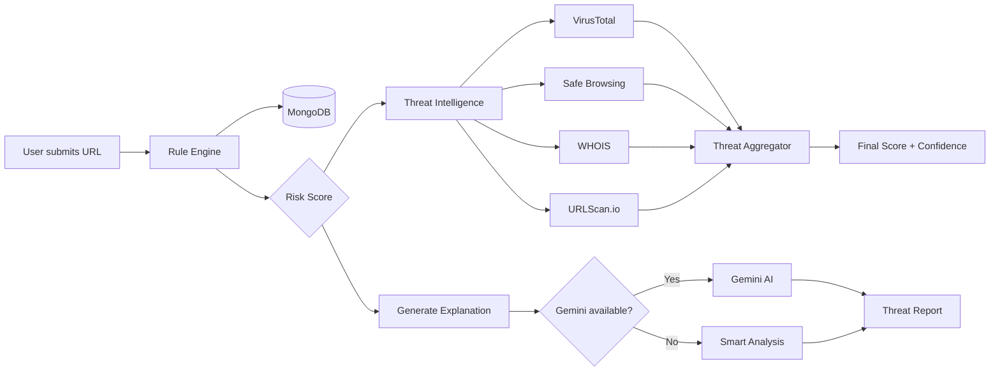

<div align="center">

# 🛡️ PhishGuard AI

### *Don't guess if a link is dangerous — understand why.*

**An AI-assisted phishing detection platform that scores URLs, cross-checks global threat feeds, and explains every finding in plain English.**

<br/>

[](https://nodejs.org/)
[](https://react.dev/)
[](https://www.mongodb.com/)
[](LICENSE)

[Live Demo](#) · [Quick Start](#-quick-start) · [Project Report](https://drive.google.com/file/d/1KGpM4BpGWUpSvoUH2dn0IajDQGyO2whz/view?usp=drive_link) · [API Reference](#-api-overview) · [Architecture](#-how-it-works)

<br/>

```
   ┌─────────────┐     ┌──────────────────┐     ┌─────────────────────┐
   │  Paste URL  │ ──▶ │  Rule Engine     │ ──▶ │  Risk Score 0–100   │
   └─────────────┘     │  (instant)       │     │  Safe → Critical    │
                       └────────┬─────────┘     └──────────┬──────────┘
                                │                            │
                                ▼                            ▼
                       ┌──────────────────┐     ┌─────────────────────┐
                       │ Threat Intel     │     │ Smart Explanation   │
                       │ VT · GSB · WHOIS │     │ Gemini or fallback  │
                       │ URLScan.io       │     │ tells you *why*       │
                       └──────────────────┘     └─────────────────────┘
```

</div>

---

## 🎯 Why PhishGuard?

Most security tools give you a red light or a green light. **PhishGuard gives you a story.**

| Typical scanner | PhishGuard AI |
|-----------------|---------------|
| "Suspicious" | "HTTPS missing + 4 subdomains mimicking `login.bank.com`" |
| Black-box score | Weighted score from **5 independent sources** |
| No context | Recommendations, security tips, and threat timeline |
| One-shot check | Per-user scan history, reports, and dashboard analytics |

Built for **students, developers, and security-curious users** who want to *learn* while they protect themselves.

---

## ✨ Features

<table>
<tr>
<td width="50%">

### 🔗 URL Intelligence Engine
Rule-based scanner with **zero external API dependency** for core scoring:
- HTTPS / HTTP detection
- IP-address URLs & Punycode homographs
- Suspicious keywords & link shorteners
- Special-character obfuscation
- Subdomain depth analysis

</td>
<td width="50%">

### 🌐 Multi-Source Threat Intelligence
Parallel queries with **graceful degradation** — one failed API never kills the scan:
- **VirusTotal** — multi-vendor reputation
- **Google Safe Browsing** — phishing & malware lists
- **WHOIS / RDAP** — domain age & registrar
- **URLScan.io** — live page analysis + redirect chain

</td>
</tr>
<tr>
<td>

### 🤖 Threat Explanations
- **Gemini-powered** natural-language breakdowns (optional)
- **Smart Analysis fallback** — detailed, URL-specific explanations when AI is offline
- Attack type classification, reasons, recommendations & tips

</td>
<td>

### 📊 Dashboard & Reports
- JWT-secured accounts
- Scan history & threat reports
- Confidence meter & aggregated final risk score
- Dark cyber-themed UI (Tailwind)

</td>
</tr>
</table>

---

## 🧠 How It Works



### Scoring weights (Threat Intelligence)

| Source | Weight | What it checks |
|--------|--------|----------------|
| Rule Engine | 30% | URL structure & heuristics |
| VirusTotal | 25% | Vendor malware detections |
| Safe Browsing | 20% | Google threat blocklists |
| WHOIS | 15% | Domain age & registration |
| URLScan.io | 10% | Live page & redirects |

> Unavailable sources are skipped — remaining weights are redistributed automatically.

---

## 📄 Project Report

Full project documentation, architecture, and implementation details:

**[📥 PhishGuard AI — Complete Project Report (PDF)](https://drive.google.com/file/d/1KGpM4BpGWUpSvoUH2dn0IajDQGyO2whz/view?usp=drive_link)**

---

## 🚀 Quick Start

### Prerequisites

- **Node.js** 18+
- **MongoDB** — [local](https://www.mongodb.com/try/download/community) or [Atlas](https://www.mongodb.com/cloud/atlas) free tier
- API keys (optional but recommended for full intel + Gemini)

---

### 1️⃣ Clone & install

```bash
git clone https://github.com/KnightByte-IO/PhishGuard-AI.git
cd PhishGuard-AI
```

---

### 2️⃣ Backend

```bash
cd backend
npm install
cp .env.example .env
```

Edit `backend/.env`:

```env
PORT=5000
MONGODB_URI=mongodb://127.0.0.1:27017/phishguard-ai
JWT_SECRET=change_this_to_a_long_random_string

# Optional — AI explanations (must start with AIza)
GEMINI_API_KEY=your_key_from_aistudio.google.com
GEMINI_MODEL=gemini-1.5-flash

# Optional — Threat Intelligence
VIRUSTOTAL_API_KEY=
GOOGLE_SAFE_BROWSING_API_KEY=
URLSCAN_API_KEY=
```

```bash
npm run dev
```

✅ Backend → `http://localhost:5000`

---

### 3️⃣ Frontend

```bash
cd frontend
npm install
cp .env.example .env
npm run dev
```

✅ Frontend → `http://localhost:5173`

> The Vite dev server proxies `/api` → `http://localhost:5000`, so port changes won't break API calls.

---

### 4️⃣ Create an account & scan

1. Open `http://localhost:5173`
2. **Register** → **Login**
3. Go to **URL Scanner** → paste a URL → **Analyze**
4. Click **Run Threat Intelligence** for multi-source analysis
5. Click **Generate AI Explanation** for the full threat breakdown

---

## ☁️ Deployment

### Live API (Render)

| Service | URL |
|---------|-----|
| **Backend API** | https://phishguard-ai-api-qdkr.onrender.com |
| **Health check** | https://phishguard-ai-api-qdkr.onrender.com/api/health |

### Frontend → Production API

`frontend/.env.production` is preconfigured:

```env
VITE_API_URL=https://phishguard-ai-api-qdkr.onrender.com/api
```

Build and deploy the frontend:

```bash
cd frontend
npm run build
# Deploy the dist/ folder to Vercel, Netlify, or Render Static Site
```

### Local frontend + Render backend

In `frontend/.env`:

```env
VITE_API_URL=https://phishguard-ai-api-qdkr.onrender.com/api
```

Restart Vite after changing `.env`.

### Render backend environment variables

Set these in the Render dashboard for the API service:

| Variable | Example |
|----------|---------|
| `MONGODB_URI` | Your Atlas connection string |
| `JWT_SECRET` | Long random string |
| `GEMINI_API_KEY` | `AIza...` from Google AI Studio |
| `VIRUSTOTAL_API_KEY` | Optional |
| `GOOGLE_SAFE_BROWSING_API_KEY` | Optional |
| `URLSCAN_API_KEY` | Optional |
| `CLIENT_URL` | Your frontend URL (comma-separated if multiple) |

> Free Render instances **spin down after inactivity** — the first request may take 30–60 seconds to wake up.

---

## 🔑 API Keys Setup

| Service | Get key | Enable in console |
|---------|---------|-------------------|
| **Gemini** | [Google AI Studio](https://aistudio.google.com/apikey) | Keys start with `AIza` |
| **VirusTotal** | [virustotal.com/gui/my-apikey](https://www.virustotal.com/gui/my-apikey) | Free tier: 4 req/min |
| **Safe Browsing** | [Google Cloud Console](https://console.cloud.google.com/apis/credentials) | Enable **Safe Browsing API** |
| **URLScan.io** | [urlscan.io/user/profile](https://urlscan.io/user/profile/) | API key in profile |

> ⚠️ Never commit real keys. `.env` is gitignored — use `.env.example` as a template only.

---

## 📡 API Overview

### Auth

| Method | Endpoint | Description |
|--------|----------|-------------|
| `POST` | `/api/auth/register` | Create account |
| `POST` | `/api/auth/login` | Login → JWT |
| `GET` | `/api/auth/profile` | Profile *(auth)* |

### URL Intelligence *(auth required)*

| Method | Endpoint | Description |
|--------|----------|-------------|
| `POST` | `/api/url/analyze` | Rule-based URL scan |
| `POST` | `/api/url/intelligence` | Multi-source threat intel |
| `POST` | `/api/url/explain` | Generate threat explanation |
| `GET` | `/api/url/history` | Scan history |
| `GET` | `/api/url/stats` | Dashboard statistics |
| `GET` | `/api/url/reports` | Threat reports list |
| `GET` | `/api/url/reports/:id` | Single threat report |

### Settings *(auth required)*

| Method | Endpoint | Description |
|--------|----------|-------------|
| `GET` | `/api/settings/profile` | Get profile |
| `PUT` | `/api/settings/profile` | Update profile |
| `PUT` | `/api/settings/password` | Change password |

### Health

| Method | Endpoint | Description |
|--------|----------|-------------|
| `GET` | `/api/health` | Server status |

---

## 🏗️ Project Structure

```
PhishGuard-AI/
├── backend/
│   ├── config/           # MongoDB connection
│   ├── controllers/      # Route handlers
│   ├── middleware/       # JWT auth guard
│   ├── models/           # User, UrlScan schemas
│   ├── routes/           # auth · url · settings
│   ├── services/
│   │   ├── urlAnalysisService.js       # Rule engine
│   │   ├── threatIntelligenceService.js # Intel orchestrator
│   │   ├── threatAggregator.js         # Weighted scoring
│   │   ├── virusTotalService.js
│   │   ├── safeBrowsingService.js
│   │   ├── whoisService.js
│   │   ├── urlScanService.js
│   │   ├── geminiThreatService.js      # Gemini explanations
│   │   └── fallbackExplanationService.js
│   └── server.js
│
└── frontend/
    └── src/
        ├── components/     # UI + threat report widgets
        ├── pages/          # Landing + dashboard
        ├── services/       # Axios API client
        └── context/        # Auth state (JWT)
```

---

## 🛠️ Tech Stack

| Layer | Technologies |
|-------|-------------|
| **Frontend** | React 18 · Vite · Tailwind CSS · React Router · Axios |
| **Backend** | Node.js · Express · Mongoose · JWT · bcrypt |
| **Database** | MongoDB |
| **AI** | Google Gemini (`@google/generative-ai`) |
| **Threat Intel** | VirusTotal v3 · Google Safe Browsing v4 · RDAP/WHOIS · URLScan.io |

---

## 🗺️ Roadmap

- [ ] Browser extension for one-click URL checks
- [ ] Email header analyzer
- [ ] Team / organization dashboards
- [ ] Webhook alerts for high-risk scans
- [ ] Exportable PDF threat reports

---

## 🤝 Contributing

Contributions are welcome! If you found a bug or want to add a feature:

1. Fork the repo
2. Create a branch (`git checkout -b feature/amazing-thing`)
3. Commit your changes
4. Open a Pull Request

---

## 📄 License

This project is licensed under the **MIT License** — use it, fork it, learn from it.

---

<div align="center">

**Built with ☕ and paranoia about suspicious links.**

If PhishGuard AI helped you avoid a bad click, consider giving the repo a ⭐

<br/>

<sub>PhishGuard AI · Detect phishing before it detects you.</sub>

</div>
